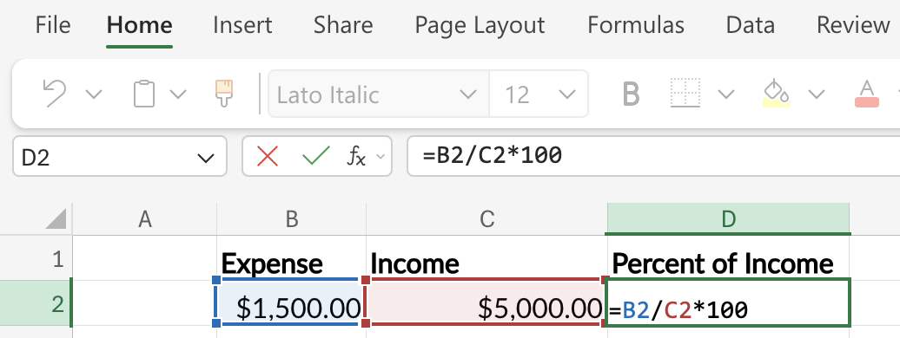
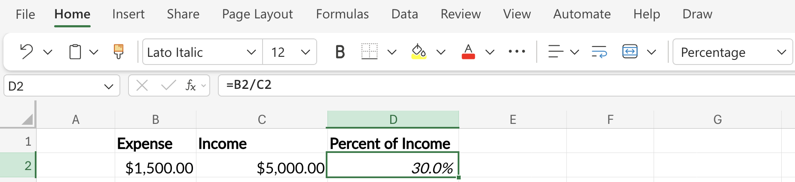
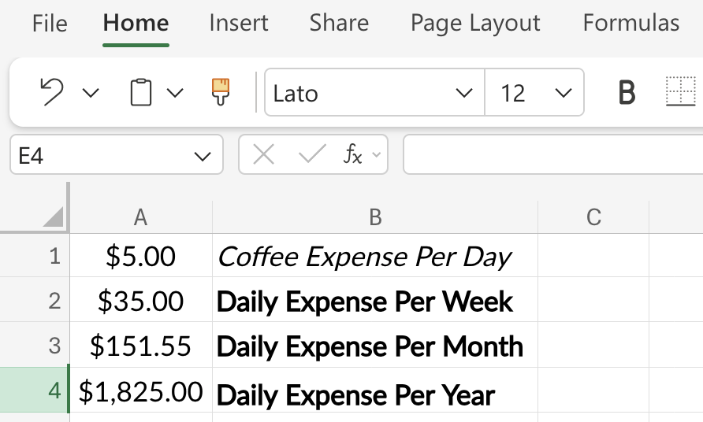
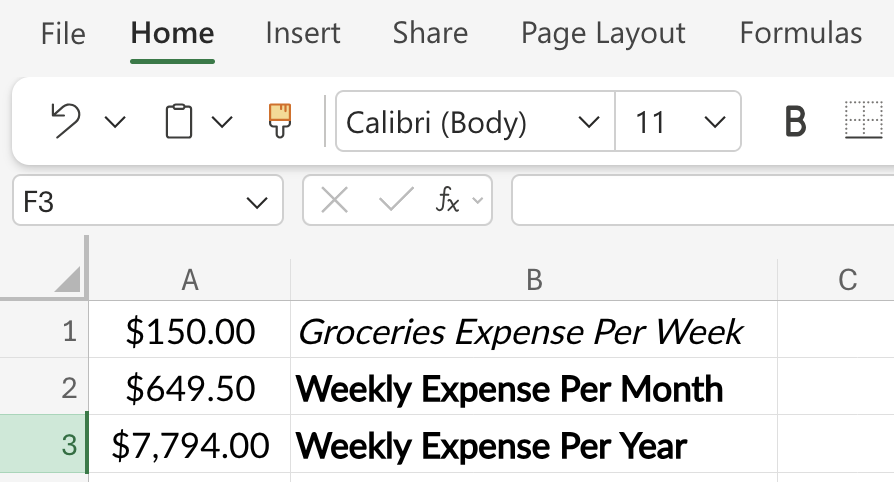
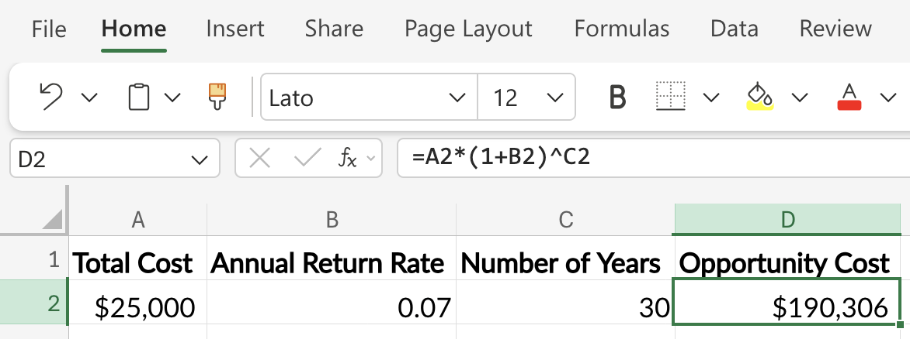
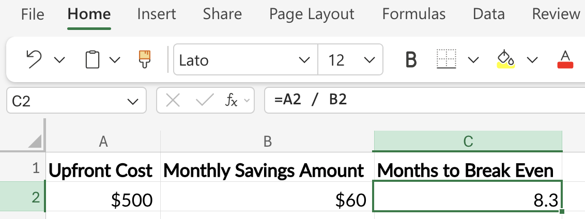

# Budgeting

```{r}
#| label: setup-r
#| message: false
#| warning: false
#| include: false
source("_common.R")
```

```{python}
#| label: setup-py
#| include: false
```

<br>

Most people hate budgeting because they're approaching it with some bad assumptions. Traditional budgets typically fail because they assume humans will robotically track every penny and restrict every joy, all with a kind of mindless automation. But a good budget shouldn't make you feel constrained; it should make you feel intentional about how you allocate your financial resources.[^budgeting-1]

[^budgeting-1]: I've included frameworks from [Sethi](https://www.iwillteachyoutoberich.com/), [Housel](https://www.morganhousel.com/), [Bogle](https://www.bogleheads.org/wiki/Main_Page), and [Felix](https://www.linkedin.com/in/benjaminwfelix/) because they are designed for how humans actually behave.

## The Budget Mindset Shift

A good budget builds in flexibility, not rigidity. When you're just getting started, budgeting can be overwhelming.

> "*A budget tells your money where to go instead of wondering where it went.*" - Ramit Sethi

Just to be clear: **building a budget (especially the first time) is time-consuming**. As with most time-consuming tasks, you might find yourself wondering if you really need a budget. Trust me—you do. Everyone does. Reframe the following thoughts that might interfere with your budgeting practice:

| Thought | Reframe as |
|----|----|
| [***I have to spend a \[relatively large amount\] on \[thing(s) I need\].***]{style="color:#f44242; font-weight: bold;"} | [***My needs cost \[amount\].***]{style="color:#48a56a; font-weight: bold;"} |
| [***I can only spend \[relatively small amount\] on \[thing(s) I really want\].***]{style="color:#f44242; font-weight: bold;"} | [***My wants cost \[amount\].***]{style="color:#48a56a; font-weight: bold;"} |
| [***I spent \[unexpectedly large amount\] on \[thing(s) I really want\].***]{style="color:#f44242; font-weight: bold;"} | [***I chose to spend more on my wants this month, so I need to adjust my other categories.***]{style="color:#48a56a; font-weight: bold;"} |
| [***I spent \[unexpectedly large amount\] on \[thing(s) I don’t really need or want\]?!?***]{style="color:#f44242; font-weight: bold;"} | [***I need to adjust my other categories and figure out how to avoid this spending in the future.***]{style="color:#48a56a; font-weight: bold;"} |

Morgan Housel's insight is powerful here: "*room for error is the most underrated financial concept.*"

## Expense Categories

The first skill in budgeting is correctly categorizing your money. Most people lump everything together and then get overwhelmed by how to allocate or account for their spending. Generally, expenses can all fit into one of three categories:

| Category | Definition | Strategy |
|-----------------|---------------------------|---------------------------|
| **Fixed** | Costs that remain the same each month, such as rent, mortgage payments, or subscription services. | Lock these in and forget them (minimize them once, then automate). Biggest leverage point: housing. |
| **Variable** | Costs that change from month to month, such as groceries, utilities, and entertainment. | This is the category where most budgeting efforts fail. Use **categories with limits**, not line-by-line tracking. |
| **Periodic** | Costs that occur less frequently than monthly, such as annual insurance premiums, holiday gifts, or car maintenance. | These are silent budget killers. Set aside 1/12 of the annual cost for these each month. |

Fixed and variable expenses should employ different strategies. Periodic expenses are trickier because they are specific to the item/person.

```{=html}
<style>

.codeStyle span:not(.nodeLabel) {
  font-family: monospace;
  font-size: 1.5em;
  font-weight: bold;
  color: #9753b8 !important;
  background-color: #f6f6f6;
  padding: 0.2em;
}
</style>
```

```{mermaid}
%%| fig-cap: 'Fixed vs. Variable Expenses'
%%| fig-align: center
%%{init: {'theme': 'neutral', 'themeVariables': { 'fontFamily': 'monospace', "fontSize":"16px"}}}%%

flowchart LR

    Expenses(["Monthly<br>Expenses"])
    
    subgraph Fixed["FIXED EXPENSES"]
        Rent("Rent/Mortgage")
        Insurance("Insurance<br>Premiums")
        Subs("Subscriptions")
        Loans("Loan<br>Payments")
    end
    
    subgraph Variable["VARIABLE EXPENSES"]
        Groceries("Groceries")
        Utilities("Utilities")
        Gas("Gas/Transport")
        Dining("Dining<br>Out")
    end

    subgraph Periodic["PERIODIC EXPENSES"]
        Taxes("Property<br>Taxes")
        CarMaint("Car<br>Maintenance")
        Gifts("Gifts/Holidays")
        Medical("Medical Costs")
    end
    
    Expenses --> Fixed  
    Expenses --> Variable 
    Expenses --> Periodic
    
    style Expenses fill:#48a56a,color:#F5F2E8,stroke:#1C1C1E,stroke-width:2px
    
    style Fixed fill:#f44242,color:#F5F2E8,stroke:#1C1C1E,stroke-width:2px
    style Rent fill:#f44242,color:#F5F2E8,stroke:#1C1C1E,stroke-width:2px
    style Insurance fill:#f44242,color:#F5F2E8,stroke:#1C1C1E,stroke-width:2px
    style Subs fill:#f44242,color:#F5F2E8,stroke:#1C1C1E,stroke-width:2px
    style Loans fill:#f44242,color:#F5F2E8,stroke:#1C1C1E,stroke-width:2px
    
    style Variable fill:#0e9aa7,color:#F5F2E8,stroke:#1C1C1E,stroke-width:2px
    style Groceries fill:#86ddcd,color:#1C1C1E,stroke:#1C1C1E,stroke-width:2px
    style Utilities fill:#86ddcd,color:#1C1C1E,stroke:#1C1C1E,stroke-width:2px
    style Gas fill:#86ddcd,color:#1C1C1E,stroke:#1C1C1E,stroke-width:2px
    style Dining fill:#86ddcd,color:#1C1C1E,stroke:#1C1C1E,stroke-width:2px
    
    style Periodic fill:#F5F2E8,color:#1C1C1E,stroke:#1C1C1E,stroke-width:2px
    style Taxes fill:#F5F2E8,color:#1C1C1E,stroke:#1C1C1E,stroke-width:2px
    style CarMaint fill:#F5F2E8,color:#1C1C1E,stroke:#1C1C1E,stroke-width:2px
    style Gifts fill:#F5F2E8,color:#1C1C1E,stroke:#1C1C1E,stroke-width:2px
    style Medical fill:#F5F2E8,color:#1C1C1E,stroke:#1C1C1E,stroke-width:2px
    
```

### Example periodic expense: car insurance {.unnumbered}

If your car insurance is \$1,200/year, don't get blindsided every six months. Save \$100/month into a "Car Insurance" sub-account. When the bill arrives, the money is already there. Repeat for every periodic expense:

- Christmas/gifts: \$600/year → \$50/month
- Car maintenance: \$1,200/year → \$100/month
- Annual vacation: \$2,400/year → \$200/month

This single technique eliminates 80% of budget emergencies.

## Types of Budgets

Two dominant frameworks exist: zero-based and percentage. Either one will work; just pick the one that matches your personality. Zero-based budgets offer tight control and are detail-oriented, making them ideal for anyone rebuilding from debt or with irregular income. Percentage budgets are for big-picture thinkers, stable income earners, and people who hate detailed tracking.

### Zero-Based Budgeting {.unnumbered}

Every dollar gets a job. Income minus all allocations equals zero. Assume you have a monthly income of \$5000:

| Category      | Amount      |
|:--------------|:------------|
| Rent          | \$1,500     |
| Groceries     | \$500       |
| Transport     | \$300       |
| Investments   | \$1,000     |
| Savings       | \$500       |
| Fun Money     | \$700       |
| Other         | \$500       |
| **Total**     | **\$5,000** |
| **Remaining** | **\$0**     |

: Zero-Based Budgeting

Zero-based budgets provide maximum awareness, make every dollar spent/saved/invested intentional, and immediately expose leaks. However, these are high-maintenance, can feel a little restrictive, and require monthly re-budgeting.

### Percentage-Based Budgeting {.unnumbered}

Allocate by percentages, not dollars. This is the foundation of Sethi's Conscious Spending Plan[^budgeting-2] and another popular framework (50/30/20).

[^budgeting-2]: This plan is covered on his [website](https://www.iwillteachyoutoberich.com/conscious-spending-basics/) and in [this Reddit post](https://www.reddit.com/r/singaporefi/comments/1oohihc/do_you_have_your_own_version_of_conscious/)

| Bucket              | Conscious Spending Plan (Sethi) | 50/30/20 Rule    |
|---------------------|---------------------------------|------------------|
| Fixed Costs         | 50–60%                          | 50% Needs        |
| Investments         | 10%+                            | 20% Savings/Debt |
| Savings Goals       | 5–10%                           | (combined above) |
| Guilt-Free Spending | 20–35%                          | 30% Wants        |

: Percentage-Based Budgeting

Percentages are great because they’re the proportion of your earnings assigned to each category, which means they scale to any income and, after you’ve categorized your expenses, they are low maintenance. However, they are also less granular, can mask overspending in certain categories, and require you to be brutally honest about the category boundaries.

### Which Should You Choose? {.unnumbered}

```{mermaid}
%%| fig-cap: 'Which Budget To Choose?'
%%| fig-align: center
%%{init: {'theme': 'neutral', 'themeVariables': { 'fontFamily': 'monospace', "fontSize":"16px"}}}%%

flowchart TD
    Choose(["I Need<br>A Budget"]) --> Question1{"In Debt or<br/>Just Starting?"}
    Question1 -->|Yes| ZeroBased("Zero-Based<br/>for 6-12 months")
    Question1 -->|No| Question2{"Love Spreadsheets<br/>& Details?"}
    Question2 -->|Yes| Hybrid["Hybrid Approach"]
    Question2 -->|No| Percentage["Percentage-Based<br/>Conscious Spending"]
    ZeroBased --> Eventually["Graduate to Percentage<br/>Once Stable"]
    
    
    style Choose fill:#48a56a,color:#F5F2E8,stroke:#1C1C1E,stroke-width:2px
    style Question1 fill:#f0cfcf,color:#1C1C1E,stroke:#1C1C1E,stroke-width:2px
    style Question2 fill:#f0cfcf,color:#1C1C1E,stroke:#1C1C1E,stroke-width:2px
    style ZeroBased fill:#0e9aa7,color:#F5F2E8,stroke:#1C1C1E,stroke-width:2px
    style Hybrid fill:#86ddcd,color:#1C1C1E,stroke:#1C1C1E,stroke-width:2px
    style Percentage fill:#86ddcd,color:#1C1C1E,stroke:#1C1C1E,stroke-width:2px
    style Eventually fill:#86ddcd,color:#1C1C1E,stroke:#1C1C1E,stroke-width:2px
```

```{r}
#| label: my-rec-budget
#| echo: false
#| results: asis
#| eval: true
co_box(color = "g", 
  hsize = "1.15", 
  fold = FALSE,
  size = "1.10",
  header = "My recommendation", 
  contents = "Start with zero-based for 2-3 months to truly understand your spending. Then transition to a percentage-based system with automation. You get the awareness without the long-term burden.")
```

## Build a Budgeting Tool

Applications like Microsoft Excel or Google Sheets offer tools and templates to customize each sheet/tab to fit your needs (search for “budget template”). Most personal finance blogs also offer a free downloadable classic envelope spreadsheet. For hands-on work with a real bank export, see [Tracking Spending](tracking_spending.qmd).

### Using Spreadsheets {.unnumbered}

The `bank_statement` dataset introduced in [Tracking Spending](tracking_spending.qmd) is the foundation for the examples that follow. A well-structured spreadsheet maps those transactions into tabs that mirror your budget categories:

```{mermaid}
%%| fig-cap: 'Spreadsheet'
%%| fig-align: center
%%{init: {'theme': 'neutral', 'themeVariables': { 'fontFamily': 'monospace', "fontSize":"16px"}}}%%

flowchart LR
    Spreadsheet(["Budget<br>Spreadsheet"]) --> Tab1[Tab 1: Income]
    Spreadsheet --> Tab2[Tab 2: Fixed Expenses]
    Spreadsheet --> Tab3[Tab 3: Variable Expenses]
    Spreadsheet --> Tab4[Tab 4: Sinking Funds]
    Spreadsheet --> Tab5[Tab 5: Net Worth Tracker]
    Spreadsheet --> Tab6[Tab 6: Summary Dashboard]

    Tab6 --> Metrics("Key Metrics:<br/>Savings Rate<br/>Fixed Cost %<br/>Monthly Cash Flow")
    style Spreadsheet fill:#48a56a,color:#F5F2E8,stroke:#1C1C1E,stroke-width:2px
    style Tab1 fill:#0e9aa7,color:#F5F2E8,stroke:#1C1C1E,stroke-width:2px
    style Tab2 fill:#0e9aa7,color:#F5F2E8,stroke:#1C1C1E,stroke-width:2px
    style Tab3 fill:#0e9aa7,color:#F5F2E8,stroke:#1C1C1E,stroke-width:2px
    style Tab4 fill:#0e9aa7,color:#F5F2E8,stroke:#1C1C1E,stroke-width:2px
    style Tab5 fill:#0e9aa7,color:#F5F2E8,stroke:#1C1C1E,stroke-width:2px
    style Tab6 fill:#0e9aa7,color:#F5F2E8,stroke:#1C1C1E,stroke-width:2px
    style Metrics fill:#86ddcd,color:#1C1C1E,stroke:#1C1C1E,stroke-width:2px
```

### What Actually Matters {.unnumbered}

Don't overthink this. The best budgeting tool is [the one you'll actually use.]{style="color:#48a56a; font-weight: bold;"}

Features that matter:

1.  [Automatic transaction imports]{style="color:#48a56a; font-weight: bold;"} (saves hours per month)
2.  [Easy categorization]{style="color:#48a56a; font-weight: bold;"} (you'll do this weekly)
3.  [A clear summary view]{style="color:#48a56a; font-weight: bold;"} (your dashboard)
4.  [Goal tracking]{style="color:#48a56a; font-weight: bold;"} (motivation matters)

Features that don't matter as much: fancy graphs, AI insights, social features. Substance over style.

## Budgeting Math

Here's the secret most personal finance content avoids: *budgeting requires only middle-school math.* Each calculation below pairs a visual with a formula and code so the idea, the rule, and the implementation are always together.

### Percentages (Your Most-Used Skill) {.unnumbered}

Think of your monthly income as a single horizontal bar. Every category of spending is a labeled slice of that bar. Asking "what percentage is rent?" is just asking: *how wide is the rent slice compared to the whole bar?*

```{r}
#| label: pct-bar-model
#| echo: false
#| fig-cap: "Rent ($1,500) as a share of a $5,000 paycheck"
#| fig-asp: 0.25
library(ggplot2)
df_pct <- data.frame(
  label  = c("Rent\n$1,500", "Remaining\n$3,500"),
  amount = c(1500, 3500)
)
ggplot(df_pct, aes(x = "", y = amount, fill = label)) +
  geom_col(width = 0.5) +
  geom_text(
    aes(label = label),
    position = position_stack(vjust = 0.5),
    colour = "white", fontface = "bold", size = 4
  ) +
  coord_flip() +
  scale_fill_manual(values = c(
    "Rent\n$1,500"      = "#f44242",
    "Remaining\n$3,500" = "#0e9aa7"
  )) +
  scale_y_continuous(labels = function(x) paste0("$", format(x, big.mark = ","))) +
  labs(x = NULL, y = "Monthly income ($5,000)") +
  theme_minimal(base_size = 12) +
  theme(
    legend.position = "none",
    axis.text.y     = element_blank(),
    axis.ticks.y    = element_blank(),
    panel.grid      = element_blank()
  )
```

The formula follows directly from the bar: divide the slice width by the total bar width, then multiply by 100 to express it as a percentage.

**Formula:** (Expense ÷ Income) × 100

Example: Rent is \$1,500, income is \$5,000. → (1,500 ÷ 5,000) × 100 = **30% of income on rent.**

Practice until you can do this in your head for the big categories.

::::::: {.callout-note collapse="true"}
## R vs Python: function bodies and return values

Two more syntax differences become visible the moment you write a function with a body.

**Code block structure**

::: {layout="[50,50]" layout-valign="top"}
R wraps the body in curly braces `{}`. Indentation is purely stylistic.

Python uses a colon and an indented body. Indentation is part of the syntax (inconsistent indentation raises `IndentationError`).
:::

::: {layout="[50,50]" layout-valign="top"}
``` r
percent_of_income <- function(expense, income) {
  (expense / income) * 100
}
```

``` python
def percent_of_income(expense, income):
    return (expense / income) * 100
```
:::

**Return values**

::: {layout="[50,50]" layout-valign="top"}
R automatically returns the last evaluated expression. The `return()` function is optional.

Python requires an explicit `return` statement; otherwise the function returns `None`.
:::

::: {layout="[50,50]" layout-valign="top"}
``` r
double_fun <- function(x) x * 2
```

``` python
def double_fun(x):
    return x * 2
```
:::
:::::::

::: panel-tabset
## R

```{r}
#| label: percent-r
#| code-fold: false 
percent_of_income <- function(expense, income) {
  (expense / income) * 100
}
```

Rent of \$1,500 against \$5,000 take-home pay

```{r}
#| label: percent-r-apply
#| code-fold: false 
percent_of_income(expense = 1500, income = 5000)
```

## Python

```{python}
#| label: percent-py
#| code-fold: false 
def percent_of_income(expense, income):
    return (expense / income) * 100
```

Rent of \$1,500 against \$5,000 take-home pay

```{python}
#| label: percent-py-apply
#| code-fold: false 
percent_of_income(expense=1500, income=5000)
```

## Excel

Assuming `Expense` is in cell `B2` and `Income` is in cell `C2`:

``` swift
=(B2 / C2) * 100
```

{width="100%" fig-align="center"}

Or, more simply, enter `=B2 / C2` and format the cell as a **Percentage** using the button in the toolbar.

{width="100%" fig-align="center"}
:::

### Annualizing and Monthly-izing {.unnumbered}

A \$5 daily coffee doesn't feel expensive. The chart below makes the annual version visible — the same habit at four different time scales.

```{r}
#| label: annual-bar-model
#| echo: false
#| fig-cap: "The same $5/day habit across four time periods"
#| fig-asp: 0.50
library(ggplot2)
df_annual <- data.frame(
  period = factor(
    c("Daily\n($5)", "Weekly\n($35)", "Monthly\n($152)", "Annual\n($1,825)"),
    levels = c("Daily\n($5)", "Weekly\n($35)", "Monthly\n($152)", "Annual\n($1,825)")
  ),
  cost = c(5, 35, 152, 1825),
  fill = c("#86ddcd", "#0e9aa7", "#48a56a", "#f44242")
)
ggplot(df_annual, aes(x = period, y = cost, fill = period)) +
  geom_col(width = 0.6) +
  geom_text(aes(label = paste0("$", cost)),
            vjust = -0.4, fontface = "bold", size = 4) +
  scale_fill_manual(
    values = setNames(df_annual$fill, as.character(df_annual$period))
  ) +
  scale_y_continuous(limits = c(0, 2100),
                     labels = function(x) paste0("$", x)) +
  labs(x = NULL, y = NULL) +
  theme_minimal(base_size = 12) +
  theme(
    legend.position    = "none",
    panel.grid.major.x = element_blank(),
    panel.grid.minor   = element_blank()
  )
```

Each bar is the previous bar scaled by the number of periods it contains. The annual bar is 365× the daily bar; the monthly bar is ≈ 4.33× the weekly bar. Those multipliers are the formula.

**Daily habit → Weekly:** Multiply by 7

**Weekly → Monthly:** Multiply by 4.33 (not 4)

**Monthly → Annual:** Multiply by 12

Or you can directly convert a daily habit into the total cost per year:

**Daily habit → Annual:** Multiply by 365

See how much an annual subscription is costing per month:

**Annual → Monthly:** Divide by 12

Example: A \$5 daily coffee → \$5 × 365 = [\$1,825/year.]{style="color:#f44242; font-weight: bold;"} Suddenly it's a real number you can evaluate.

::: panel-tabset
## R

```{r}
#| label: annualize-r
#| code-fold: false 
to_annual <- function(amount, period = c("daily", "weekly", "monthly")) {
  period  <- match.arg(period)
  factors <- c(daily = 365, weekly = 52, monthly = 12)
  amount * factors[[period]]
}
```

```{r}
#| label: monthly-r
#| code-fold: false 
to_monthly <- function(amount, period = c("daily", "weekly", "annual")) {
  period  <- match.arg(period)
  factors <- c(daily = 30.44, weekly = 4.33, annual = 1 / 12)
  amount * factors[[period]]
}
```

\$5/day coffee over the course of a year:

```{r}
#| label: annualize-r-apply
#| code-fold: false 
to_annual(amount = 5, period = "daily")    
```

\$150 per week on groceries over the course of a month.

```{r}
#| label: monthly-r-apply
#| code-fold: false 
to_monthly(amount = 150, period = "weekly")   
```

## Python

```{python}
#| label: annualize-py
#| code-fold: false 
def to_annual(amount, period="daily"):
    factors = {"daily": 365, "weekly": 52, "monthly": 12}
    return amount * factors[period]
```

```{python}
#| label: monthly-py
#| code-fold: false 
def to_monthly(amount, period="daily"):
    factors = {"daily": 30.44, "weekly": 4.33, "annual": 1 / 12}
    return amount * factors[period]
```

\$5/day coffee over the course of a year:

```{python}
#| label: annualize-py-apply
#| code-fold: false 
print(to_annual(amount=5,period="daily"))    
```

\$150 per week on groceries over the course of a month.

```{python}
#| label: monthly-py-apply
#| code-fold: false 
print(to_monthly(amount=150,period="weekly"))   
```

## Excel

Let's start with the daily value in cell `A1`, then convert it to the cost per week in cell `A2`:

``` swift
=A1 * 7
```

Next we can convert the week to the monthly cost in cell `A3`:

``` swift
=A2 * 4.33
```

Finally, we get the annual cost in cell `A4`:

``` swift
=A1 * 365
```

Format cells `A1` - `A4` as **Currency** or **Accounting**.

{width="100%" fig-align="center"}

To convert a weekly value in cell `A1` to a monthly value, place the following formula in cell `A2`:

``` swift
=A1 * 4.33
```

To convert the monthly cost to an annual cost, enter the following in cell `A3`:

``` swift
=A2 * 12
```

Format cells `A1` - `A3` as **Currency** or **Accounting**.

{width="100%" fig-align="center"}
:::

### Opportunity Cost Math {.unnumbered}

This is Felix's signature framework. [Every dollar spent isn't just that dollar; it's what that dollar could have become.]{style="color:#48a56a; font-weight: bold;"}

The chart below shows what happens when you choose the used car (\$15,000) over the new one (\$40,000) and invest the \$25,000 difference at 7% per year. Each bar is the previous one grown by one year's return.

```{r}
#| label: opp-cost-bar-model
#| echo: false
#| fig-cap: "$25,000 invested at 7% — value at each checkpoint"
#| fig-asp: 0.50
library(ggplot2)
yrs  <- c(0, 5, 10, 20, 30)
vals <- round(25000 * (1.07)^yrs)
df_opp <- data.frame(
  year  = factor(paste0("Year ", yrs), levels = paste0("Year ", yrs)),
  value = vals
)
ggplot(df_opp, aes(x = year, y = value)) +
  geom_col(fill = "#0e9aa7", width = 0.6) +
  geom_text(
    aes(label = paste0("$", formatC(value, format = "d", big.mark = ","))),
    vjust = -0.4, fontface = "bold", size = 3.5
  ) +
  scale_y_continuous(
    limits = c(0, max(vals) * 1.18),
    labels = function(x) paste0("$", round(x / 1000), "k")
  ) +
  labs(x = NULL, y = NULL) +
  theme_minimal(base_size = 12) +
  theme(
    panel.grid.major.x = element_blank(),
    panel.grid.minor   = element_blank()
  )
```

Each bar is the previous one multiplied by (1 + 0.07). After *n* multiplications, the pattern becomes the formula.

**Formula:** amount × (1 + r)\^n

Example: \$25,000 × (1.07)\^30 = [\~\$190,000.]{style="color:#f44242; font-weight: bold;"}

::: panel-tabset
## R

Below is an opportunity cost function that takes the dollar `amount`, the `rate` of return, over a proposed number of `years`

```{r}
#| label: opp-cost-r
#| code-fold: false 
opportunity_cost <- function(amount, rate, years) {
  amount * (1 + rate)^years
}
```

\$25,000 gap between two car choices, invested at 7% for 30 years

```{r}
#| label: opp-cost-r-apply
#| code-fold: false 
opportunity_cost(amount = 25000, rate = 0.07, years = 30)
```

## Python

Below is an opportunity cost function that takes the dollar `amount`, the `rate` of return, over a proposed number of `years`

```{python}
#| label: opp-cost-py
#| code-fold: false 
def opportunity_cost(amount, rate, years):
    return amount * (1 + rate) ** years
```

\$25,000 gap between two car choices, invested at 7% for 30 years

```{python}
#| label: opp-cost-py-apply
#| code-fold: false 
opportunity_cost(amount=25000, rate=0.07, years=30)
```

## Excel

Assuming the initial amount is in cell `A2`, the annual rate (as a decimal, e.g., 0.07) is in `B2`, and the number of years is in `C2`:

``` excel
=A2*(1+B2)^C2
```

{width="100%" fig-align="center"}
:::

That's not a car payment difference; that's a retirement chapter.

### Break-Even and Payback Calculations {.unnumbered}

Useful for evaluating subscriptions, refinances, and big purchases.

Each month, the cumulative savings bar grows by the monthly savings amount. Break-even is the first month that bar meets the upfront cost line.

```{r}
#| label: break-even-bar-model
#| echo: false
#| fig-cap: "$60/month savings accumulating toward a $500 upfront cost"
#| fig-asp: 0.50
library(ggplot2)
months <- 1:10
df_be  <- data.frame(
  month   = factor(paste0("Mo ", months), levels = paste0("Mo ", months)),
  saved   = months * 60
)
df_be$reached <- df_be$saved >= 500
ggplot(df_be, aes(x = month, y = saved, fill = reached)) +
  geom_col(width = 0.65) +
  geom_hline(yintercept = 500, colour = "#f44242",
             linewidth = 1, linetype = "dashed") +
  annotate("text", x = 5.5, y = 520,
           label = "Upfront cost: $500",
           colour = "#f44242", fontface = "bold", size = 3.5) +
  scale_fill_manual(values = c("FALSE" = "#0e9aa7", "TRUE" = "#48a56a")) +
  scale_y_continuous(labels = function(x) paste0("$", x)) +
  labs(x = NULL, y = "Cumulative savings") +
  theme_minimal(base_size = 12) +
  theme(
    legend.position    = "none",
    panel.grid.major.x = element_blank(),
    panel.grid.minor   = element_blank()
  )
```

The formula names the crossover point: the month when cumulative savings first equals the upfront cost.

**Formula:** Upfront cost ÷ Monthly savings = months to break even

Example: \$500 ÷ \$60 = **8.3 months to break even.**

::: panel-tabset
## R

```{r}
#| label: break-even-r
#| code-fold: false
months_to_break_even <- function(upfront_cost, monthly_savings) {
  upfront_cost / monthly_savings
}
```

A \$500 membership that saves \$60/month

```{r}
#| label: break-even-r-apply
#| code-fold: false
months_to_break_even(upfront_cost = 500, monthly_savings = 60)
```

## Python

```{python}
#| label: break-even-py
#| code-fold: false
def months_to_break_even(upfront_cost, monthly_savings):
    return upfront_cost / monthly_savings
```

A \$500 membership that saves \$60/month

```{python}
#| label: break-even-py-apply
#| code-fold: false
months_to_break_even(upfront_cost=500, monthly_savings=60)
```

## Excel

Assuming the upfront cost is in cell `A2` and the monthly savings amount is in cell `B2`:

``` swift
=A2 / B2
```

{width="100%" fig-align="center"}
:::

That \$500 membership is worth it if you'll use it longer than 8.33 months.

## Putting It All Together

```{mermaid}
%%| fig-cap: 'Put It All Together'
%%| fig-align: center
%%{init: {'theme': 'neutral', 'themeVariables': { 'fontFamily': 'monospace', "fontSize":"16px"}}}%%

flowchart TD
    Start(["Build Your Budget"]) --> Step1("Step 1. Track<br>Spending for<br>30 Days")
    Step1 --> Step2("Step 2. Categorize Fixed vs. Variable vs. Periodic")
    Step2 --> Step3("Step 3. Calculate<br>Current Savings Rate")
    Step3 --> Step4("Step 4. Choose Framework (Zero-Based or Percentage)")
    Step4 --> Step5("Step 5. Set Up<br>Sinking Funds for<br>Periodic Expenses")
    Step5 --> Step6("Step 6. Automate Everything<br>Investments First")
    Step6 --> Step7("Step 7. Review<br>Weekly, Adjust Monthly")
    Step7 --> Step8(["Step 8. Recalibrate<br>Quarterly"])
    style Start fill:#48a56a,color:#F5F2E8,stroke:#1C1C1E,stroke-width:2px
    style Step1 fill:#0e9aa7,color:#F5F2E8,stroke:#1C1C1E,stroke-width:2px
    style Step2 fill:#0e9aa7,color:#F5F2E8,stroke:#1C1C1E,stroke-width:2px
    style Step3 fill:#0e9aa7,color:#F5F2E8,stroke:#1C1C1E,stroke-width:2px
    style Step4 fill:#0e9aa7,color:#F5F2E8,stroke:#1C1C1E,stroke-width:2px
    style Step5 fill:#0e9aa7,color:#F5F2E8,stroke:#1C1C1E,stroke-width:2px
    style Step6 fill:#0e9aa7,color:#F5F2E8,stroke:#1C1C1E,stroke-width:2px
    style Step7 fill:#0e9aa7,color:#F5F2E8,stroke:#1C1C1E,stroke-width:2px
    style Step8 fill:#86ddcd,color:#1C1C1E,stroke:#1C1C1E,stroke-width:2px
```

## Key takeaways

A budget is just a plan for your money in advance. Good budgets:

1.  [Match your personality.]{style="color:#48a56a; font-weight: bold;"} Don't fight your nature; work with it.
2.  [Automate the boring stuff.]{style="color:#48a56a; font-weight: bold;"} Investments, bills, sinking funds: set and forget.
3.  [Leave room for joy.]{style="color:#48a56a; font-weight: bold;"} Sethi's guilt-free spending isn't optional; it's what makes budgets sustainable.
4.  [Track one number above all]{style="color:#48a56a; font-weight: bold;"}: the important number is your savings rate (which we will cover in [Savings](savings.qmd)). Everything else is detail.
5.  [Builds in margin for error.]{style="color:#48a56a; font-weight: bold;"} Housel's principle, "*reality is messier than spreadsheets.*"

Budgeting math isn't hard. The categories aren't complicated. The tools are abundant. What's actually required is [the decision to be intentional]{style="color:#48a56a; font-weight: bold;"}, and the patience to let small, consistent allocations compound into a life of financial freedom.

As Bogle reminded us about investing, the same applies to budgeting: [don't do something, just stand there.]{style="color:#48a56a; font-weight: bold;"} Set up the system, then let it work.
