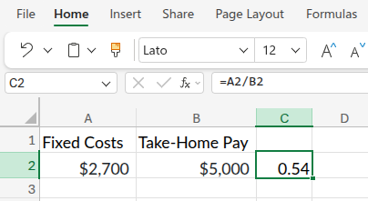
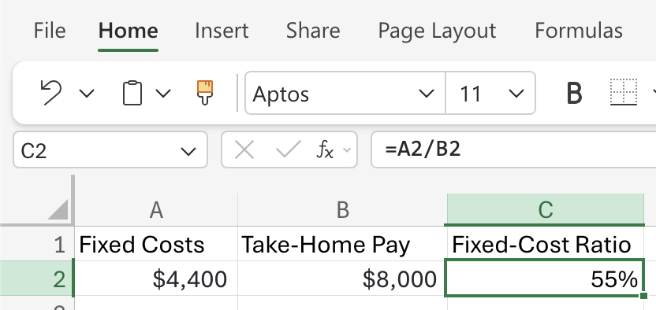
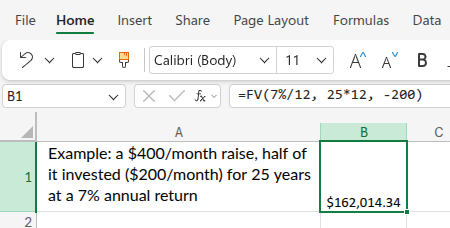

# Income

```{r}
#| label: setup-r
#| message: false
#| warning: false
#| include: false
source("_common.R")
```

```{python}
#| label: setup-py
#| include: false
```

<br>

Building wealth doesn't start with picking the right stock or finding a hot investment; it starts with how you manage the money flowing in and out of your life. Let's break down the foundational principles.

## Some Core Truths

Here's a counterintuitive insight from Morgan Housel[^wealth]:

> "*Wealth is the nice cars not purchased. The diamonds not bought. The watches not worn, the clothes forgone and the first-class upgrade declined. Wealth is financial assets that haven’t yet been converted into the stuff you see.*" - [Morgan Housel](https://www.morganhousel.com/)

[^wealth]: Read more in [Morgan Housel's The Psychology of Money](https://www.goodreads.com/quotes/11756295-wealth-is-the-nice-cars-not-purchased-the-diamonds-not)

The person driving the flashy car isn't necessarily wealthy; they just spent their money on a car. True wealth is the income you *didn't* spend, quietly compounding in the background.

[Ben Felix](https://rationalreminder.ca/) reinforces this with hard data. Research consistently shows that *conspicuous consumption (signaling wealth through purchases) is negatively correlated with actual wealth.*[^consp-consump] People who *look* rich usually aren’t, while the people who *are* rich typically live below their income level.

[^consp-consump]:Read more in [Social class, social self-esteem, and conspicuous consumption.](https://pmc.ncbi.nlm.nih.gov/articles/PMC7905187/#sec6)

## Your Human Capital

One of Felix's most powerful contributions is reframing how we think about income itself. He encourages investors to view themselves as having two forms of capital. When you're young, your single biggest asset is your future earning potential. 

```{=html}
<style>

.codeStyle span:not(.nodeLabel) {
  font-family: monospace;
  font-size: 1.5em;
  font-weight: bold;
  color: #9753b8 !important;
  background-color: #f6f6f6;
  padding: 0.2em;
}
</style>
```

```{mermaid}
%%| fig-cap: ' Human Capital'
%%| fig-align: center
%%{init: {'theme': 'neutral', 'themeVariables': { 'fontFamily': 'monospace', "fontSize":"16px"}}}%%

flowchart TD
    TotalWealth(["Your Total<br>Economic Wealth"]) --> HumanCapital("Human Capital:<br/>Future Earning Potential")
    TotalWealth --> FinancialCapital("Financial Capital:<br/>Investments & Savings")
    HumanCapital --> EarlyCareer("Early Career:<br/>Human Capital is HUGE")
    FinancialCapital --> EarlyCareer2("Early Career:<br/>Financial Capital is small")
    EarlyCareer --> Implication["Implication:<br>Invest in Skills,<br/>Education &<br>Career Growth"]
    EarlyCareer2 --> Implication2[Implication:<br>Take More Equity<br>Risk When Young]
    style TotalWealth fill:#48a56a,color:#F5F2E8,stroke:#1C1C1E,stroke-width:2px
    style HumanCapital fill:#0e9aa7,color:#F5F2E8,stroke:#1C1C1E,stroke-width:2px
    style FinancialCapital fill:#0e9aa7,color:#F5F2E8,stroke:#1C1C1E,stroke-width:2px
    style EarlyCareer fill:#0e9aa7,color:#F5F2E8,stroke:#1C1C1E,stroke-width:2px
    style EarlyCareer2 fill:#0e9aa7,color:#F5F2E8,stroke:#1C1C1E,stroke-width:2px
    style Implication fill:#86ddcd,color:#1C1C1E,stroke:#1C1C1E,stroke-width:2px
    style Implication2 fill:#86ddcd,color:#1C1C1E,stroke:#1C1C1E,stroke-width:2px

```

During this time, investing in skills, education, and career mobility will have a higher return than any portfolio decision. Income growth, especially early in your career, is one of the most powerful wealth-building levers available. Time and energy spent developing valuable skills can pay off in later years (when these resources are less readily available). 

## Spending and Happiness

The academic research on money and well-being tends to show some practical conclusions:

- [Experiences beat possessions.]{style="color:#48a56a; font-weight: bold;"} Research shows experiential purchases generate more lasting happiness than material ones.[^exp-poss] Choose a vacation or night out over new clothes or toys.

[^exp-poss]: Van Boven, L., & Gilovich, T. (2003). "To do or to have? That is the question." *Journal of Personality and Social Psychology*, 85(6), 1193–1202. <https://doi.org/10.1037/0022-3514.85.6.1193>

- [Buying time is one of the highest-return uses of money.]{style="color:#48a56a; font-weight: bold;"} Outsourcing tasks you dislike (cleaning, lawn care, commuting time) correlates strongly with life satisfaction.[^buy-time] Real wealth should be measured in not doing things you don’t like to do (and more time spent doing things you like to do).

[^buy-time]: Whillans, A. V., Dunn, E. W., Smeets, P., Bekkers, R., & Norton, M. I. (2017). "Buying time promotes happiness." *Proceedings of the National Academy of Sciences*, 114(32), 8523–8527. <https://doi.org/10.1073/pnas.1706541114>

- [Lifestyle inflation is the silent killer.]{style="color:#f44242; font-weight: bold;"} Hedonic adaptation means each lifestyle upgrade quickly becomes the new baseline, but the financial commitment remains permanent.[^hedonic] This is the classic “keeping up with the Jonses” trap: avoid external comparisons of material wealth. Instead, focus on where you were last year (and where you’d like to be in the next year).

[^hedonic]: Dunn, E. W., Gilbert, D. T., & Wilson, T. D. (2011). "If money doesn't make you happy, then you probably aren't spending it right." *Journal of Consumer Psychology*, 21(2), 115–125. <https://doi.org/10.1016/j.jcps.2011.02.002>

- [Housing is the biggest lever.]{style="color:#48a56a; font-weight: bold;"} Housing is usually your biggest expense, so choosing how much to spend on it greatly affects your wealth. Renting can be as good as (or better than) buying when you crunch the numbers.[^housing]

[^housing]: Beracha, E., & Johnson, K. H. (2012). "Lessons from over 30 years of buy versus rent decisions: Is the American dream always wise?" *Real Estate Economics*, 40(2), 217–247. <https://doi.org/10.1111/j.1540-6229.2011.00321.x>. See also Ben Felix's analysis at [PWL Capital](https://pwlcapital.com/services/financial-wellness-coaching/) and the [Rational Reminder](https://rationalreminder.ca/) podcast.

## Three Anchoring Rules 

### 1. Sethi: "*Spend on What You Love, Cut on What You Don't*" {.unnumbered}

Love coffee? Buy the $6 latte. But maybe drive a reliable used car instead of a luxury lease. The goal isn't deprivation; it's intentionality.[^sethi-dials]

[^sethi-dials]: Sethi, R. (2019). *I Will Teach You to Be Rich* (2nd ed.). Workman Publishing. The phrase "spend extravagantly on the things you love, and cut costs mercilessly on the things you don't" is the core of Sethi's "Conscious Spending Plan" (see Chapter 4, *Conscious Spending*). More at <https://www.iwillteachyoutoberich.com/>.

### 2. Housel: "*Build a Gap Between Ego and Income*" {.unnumbered}

The wider the gap between what you earn and what your ego demands you spend, the wealthier you become. Lifestyle creep is the silent killer of financial freedom.[^housel-gap]

[^housel-gap]: Housel, M. (2020). *The Psychology of Money: Timeless lessons on wealth, greed, and happiness*. Harriman House. The "gap between your ego and your income" framing appears in Chapter 10, *Save Money*. The chapter draws on Housel's earlier essay of the same name at [Collaborative Fund](https://collabfund.com/blog/the-psychology-of-money/).

### 3. Bogle: "*Keep It Simple*" {.unnumbered}

Bogle's philosophy applies to spending, too: complexity is the enemy. The more complicated your financial life, the easier it is to lose track. Automate, simplify, repeat.[^bogle-simple]

[^bogle-simple]: Bogle, J. C. (2017). *The Little Book of Common Sense Investing: The Only Way to Guarantee Your Fair Share of Stock Market Returns* (10th Anniversary ed.). Wiley. Bogle's recurring mantra ("Simplicity is the master key to financial success") runs throughout the book and his earlier *Common Sense on Mutual Funds*. The investor community he inspired distills these ideas at <https://www.bogleheads.org/wiki/Bogleheads%C2%AE_investment_philosophy>.

## Wealth vs Income

[Scott Galloway](https://www.profgalloway.com/), an NYU Stern professor and host of the *Prof G* podcasts, distills the whole problem into a single equation in his 2024 book *The Algebra of Wealth*:[^algebra-of-wealth]

[^algebra-of-wealth]: Galloway, S. (2024). *The Algebra of Wealth: A Simple Formula for Financial Security*. Portfolio (Penguin Random House). See [profgalloway.com](https://www.profgalloway.com/) for his writing, podcasts, and the weekly *No Mercy / No Malice* newsletter.

The **Wealth Formula**:

*Wealth = Focus + (Stoicism × Time × Diversification)*

The four variables are the four levers *you* actually control:

1. Focus: pick something economically valuable and become great at it. Career, geography, and skill choice compound harder than any single financial decision early on. This is Galloway's version of Felix's human capital; [your earning engine is the asset you build first.]{style="color:#48a56a; font-weight: bold;"}

2. Stoicism: your willingness to live below your means without needing to signal otherwise will keep you from spending money you don't have on things you don't really need. Galloway, Housel, and Sethi all agree here; spending discipline is a character trait before it's a budget.[^stoicism]

[^stoicism]: [What is Stoicism?](https://plato.stanford.edu/entries/stoicism/)

3. Time: The most powerful financial variable is how many compounding years you still have. The earlier you start, the more time you have.

4. Diversification: Don't bet on a single stock, sector, or career outcome. Spread risk across asset classes, geographies, and time.

```{mermaid}
%%| fig-cap: 'Wealth Formula'
%%| fig-align: center
%%{init: {'theme': 'neutral', 'themeVariables': { 'fontFamily': 'monospace', "fontSize":"16px"}}}%%

flowchart TD
    Wealth(["<strong>Wealth</strong>"]) --> Focus("Focus is <br><em>ADDITIVE</em>")
    Wealth --> SecondTerm("Second term is<br/><em>MULTIPLICATIVE</em><br>")
    
    SecondTerm --> Stoicism("<strong>STOICISM</strong><br>Living Below Means")
    SecondTerm --> Time("<strong>TIME</strong><br>Years Compounding")
    SecondTerm --> Diversification("<strong>DIVERSIFICATION</strong><br>Smart Allocation")
    
    Focus -.Standalone Contribution.-> SomeWealth(["<strong>FOCUS</strong><br>builds some wealth<br>even if others<br>fail"])
    
    Stoicism --> Multiply{"Multiply<br>Together"}
    Time --> Multiply
    Diversification --> Multiply
    Multiply --> Compounding(["<strong>Compounding<br>Wealth Engine</strong>"])
    
    style Wealth fill:#48a56a,color:#F5F2E8,stroke:#1C1C1E,stroke-width:2px
    style SecondTerm fill:#0e9aa7,color:#F5F2E8,stroke:#1C1C1E,stroke-width:2px
    style Stoicism fill:#0e9aa7,color:#F5F2E8,stroke:#1C1C1E,stroke-width:2px
    style Time fill:#0e9aa7,color:#F5F2E8,stroke:#1C1C1E,stroke-width:2px
    style Diversification fill:#0e9aa7,color:#F5F2E8,stroke:#1C1C1E,stroke-width:2px
    style Focus fill:#0e9aa7,color:#F5F2E8,stroke:#1C1C1E,stroke-width:2px
    
    style Compounding fill:#86ddcd,color:#1C1C1E,stroke:#1C1C1E,stroke-width:2px
    style SomeWealth fill:#86ddcd,color:#1C1C1E,stroke:#1C1C1E,stroke-width:2px
    style Multiply fill:#f0cfcf,color:#1C1C1E,stroke:#1C1C1E,stroke-width:2px

```


The arithmetic does a lot of the teaching on its own. Focus is [additive](https://en.wikipedia.org/wiki/Additive_function), which means even with poor execution on the other three, a strong income engine still builds some wealth. 

```{mermaid}
%%| fig-cap: 'Wealth Collapse'
%%| fig-align: center
%%{init: {'theme': 'neutral', 'themeVariables': { 'fontFamily': 'monospace', "fontSize":"16px"}}}%%

flowchart TD
    Scenario(["Second Term:<br>(Stoicism × Time ×<br>Diversification)"]) --> Zero1["<strong>STOICISM</strong> = <code>0</code><br/><em>spending above means</em>"]
    Scenario --> Zero2("<strong>TIME</strong> = <code>0</code><br/><em>starting too late</em>")
    Scenario --> Zero3("<strong>DIVERSIFICATION</strong> = <code>0</code><br/><em>all eggs, one basket</em>")
    
    Zero1 --> Result1("Savings<br>= <code>0</code>")
    Zero2 --> Result2("Years of<br>Good Habits<br>= <code>0</code>")
    Zero3 --> Result3("Return From<br>One Big Bet<br> = <code>0</code>")
    
    Result1 --> Collapse(["Collapses to<br><code>0</code>"])
    Result2 --> Collapse
    Result3 --> Collapse
    
    Collapse --> OnlyFocus(["Only <strong>FOCUS</strong>:<br/>Wealth = Income Alone"])

    style Scenario fill:#48a56a,color:#F5F2E8,stroke:#1C1C1E,stroke-width:2px
    style Zero1 fill:#0e9aa7,color:#F5F2E8,stroke:#1C1C1E,stroke-width:2px
    style Zero2 fill:#0e9aa7,color:#F5F2E8,stroke:#1C1C1E,stroke-width:2px
    style Zero3 fill:#0e9aa7,color:#F5F2E8,stroke:#1C1C1E,stroke-width:2px
    style Result1 fill:#0e9aa7,color:#F5F2E8,stroke:#1C1C1E,stroke-width:2px
    style Result2 fill:#0e9aa7,color:#F5F2E8,stroke:#1C1C1E,stroke-width:2px
    style Result3 fill:#0e9aa7,color:#F5F2E8,stroke:#1C1C1E,stroke-width:2px
    
    style Collapse fill:#86ddcd,color:#1C1C1E,stroke:#1C1C1E,stroke-width:2px
    style OnlyFocus fill:#86ddcd,color:#1C1C1E,stroke:#1C1C1E,stroke-width:2px
    

```


However, stoicism, time, and diversification are [multiplicative](https://en.wikipedia.org/wiki/Multiplicative_function), so a zero on any one of these collapses the whole second term (i.e., spending above your means and forty years of saving compounds to nothing). 

## As Your Income Grows

This is where most people fail. A raise feels like permission to upgrade everything. Instead, focus on Felix's research-backed advice: *the marginal happiness gained from lifestyle upgrades is much smaller than people expect, while the marginal financial security from saving raises is enormous.*

```{mermaid}
%%| fig-cap: 'Interactive debugger with `browser()` or breakpoint'
%%| fig-align: center
%%{init: {'theme': 'neutral', 'themeVariables': { 'fontFamily': 'monospace', "fontSize":"16px"}}}%%

flowchart TD
    Raise(["Pay Raise"]) --> Split{"<strong>Split the Raise</strong>"}
    Split --> HalfInvest["50% to<br>Investing/Savings"]
    Split --> HalfLifestyle["50% to<br>Lifestyle"]
    HalfInvest --> WealthGrows(["Wealth Compounds"])
    HalfLifestyle --> EnjoyNow(["Enjoy the Win"])
    
    style Raise fill:#48a56a,color:#F5F2E8,stroke:#1C1C1E,stroke-width:2px
    style Split fill:#f0cfcf,color:#1C1C1E,stroke:#1C1C1E,stroke-width:2px
    style HalfInvest fill:#0e9aa7,color:#F5F2E8,stroke:#1C1C1E,stroke-width:2px
    style HalfLifestyle fill:#0e9aa7,color:#F5F2E8,stroke:#1C1C1E,stroke-width:2px
    style WealthGrows fill:#86ddcd,color:#1C1C1E,stroke:#1C1C1E,stroke-width:2px
    style EnjoyNow fill:#86ddcd,color:#1C1C1E,stroke:#1C1C1E,stroke-width:2px
```

This way, you reward yourself *and* accelerate freedom, without falling into the trap of inflating your lifestyle to match every dollar.

## Math for Income {#math-for-income}

This chapter is mostly about behavior, but I'll cover some numbers below that can turn the behaviors into something you can track. Each calculation below is also written as an R and Python function, which are covered in the callout box below.


::::::: {.callout-note collapse="true"}

## R vs Python: assignment and functions

The first two differences you'll see between R and Python in this book are how each language *names* things and how each language *defines functions*.

**Assignment**

::: {layout="[50,50]" layout-valign="top"}
R uses `<-` by convention (`=` also works).

Python uses `=`.
:::

::: {layout="[50,50]" layout-valign="top"}
``` r
x <- 10
```

``` python
x = 10
```
:::

**Function definition**

::: {layout="[50,50]" layout-valign="top"}
R uses `function()` and assigns the result to a name. The body is wrapped in curly braces `{}`.

Python uses the `def` keyword, followed by a colon and an indented body.
:::

::: {layout="[50,50]" layout-valign="top"}
``` r
add_fun <- function(a, b) {
  a + b
}
```

``` python
def add_fun(a, b):
    return a + b
```
:::
:::::::

### The Fixed-Cost Ratio {.unnumbered}

Fixed costs (rent, loan payments, insurance, utilities) are the commitments you can't easily change month to month. The chart below divides an \$8,000 take-home into its two parts — fixed and flexible — and marks the 60% ceiling that keeps the rest of the budget healthy.

```{r}
#| label: fixed-cost-bar-model
#| echo: false
#| fig-cap: "Take-home pay divided into fixed costs and flexible spending ($8,000 total)"
#| fig-asp: 0.50
library(ggplot2)
df_fc <- data.frame(
  label  = factor(c("Fixed costs", "Flexible spending"),
                  levels = c("Fixed costs", "Flexible spending")),
  amount = c(4400, 3600),
  fill   = c("#f44242", "#86ddcd")
)
ggplot(df_fc, aes(x = "", y = amount, fill = fill)) +
  geom_col(width = 0.4) +
  geom_text(
    aes(label = paste0(label, "\n$", format(amount, big.mark = ","))),
    position = position_stack(vjust = 0.5),
    colour = "white", fontface = "bold", size = 3.8
  ) +
  geom_hline(yintercept = 4800, colour = "#1C1C1E",
             linetype = "dashed", linewidth = 1) +
  annotate("text", x = 1.24, y = 5400,
           label = "60% ceiling: $4,800",
           colour = "#1C1C1E", fontface = "bold", size = 3.5, hjust = 0) +
  scale_fill_identity() +
  scale_y_continuous(
    limits = c(0, 9000),
    labels = function(x) paste0("$", format(x, big.mark = ","))
  ) +
  labs(x = NULL, y = "Take-home pay ($8,000)") +
  theme_minimal(base_size = 12) +
  theme(
    legend.position    = "none",
    axis.text.x        = element_blank(),
    axis.ticks.x       = element_blank(),
    panel.grid.major.x = element_blank(),
    panel.grid.minor   = element_blank()
  )
```

The formula names the fixed slice as a fraction of the whole bar, converted to a percentage.

**Formula:** Fixed-Cost Ratio = Fixed Costs ÷ Take-Home Pay × 100

Example: \$4,400 of fixed costs on \$8,000 take-home

::: panel-tabset

## R

Below is an implementation of this function in R:

```{r}
#| label: fixed-cost-r
fixed_cost_ratio <- function(fixed_costs, take_home) {
  (fixed_costs / take_home) * 100
}
```

\$4,400 of fixed costs on \$8,000 take-home pay

```{r}
#| label: fixed-cost-r-apply
fixed_cost_ratio(fixed_costs = 4400, take_home = 8000)
```

## Python

The same formula in Python:

```{python}
#| label: fixed-cost-py
def fixed_cost_ratio(fixed_costs, take_home):
    return (fixed_costs / take_home) * 100

```

\$4,400 of fixed costs on \$8,000 take-home pay

```{r}
#| label: fixed-cost-py-apply
fixed_cost_ratio(fixed_costs=4400, take_home=8000)
```

## Excel

In Excel there's no function to define: you put the numbers in cells and write the formula once. Enter the fixed costs in cell `A2` and take-home pay in `B2`, then in `C2`:

```swift
=A2/B2
```

That gives `0.54`. 

{width='75%' fig-align='center'}

Format `C2` as a percentage (`Home → %`, or `Ctrl+Shift+5`) and it displays [54%]{style="color:#48a56a; font-weight: bold;"}.

{width='75%' fig-align='center'}

To produce the percent *string* directly (the analog of R's `paste0(..., "%")` and Python's f-string), use `TEXT()` instead:

```swift
=TEXT(A2/B2, "0.0%")
```

{width='75%' fig-align='center'}


:::

This results in a 55% fixed-cost ratio -- just under the ceiling!

### What a Raise Is Really Worth {.unnumbered}

\$200/month doesn't sound like much. The chart below shows what that single habit produces when invested at 7% over 25 years.

```{r}
#| label: raise-value-bar-model
#| echo: false
#| fig-cap: "$200/month invested at 7% — value at each 5-year checkpoint"
#| fig-asp: 0.50
library(ggplot2)
yrs  <- c(5, 10, 15, 20, 25)
vals <- round(200 * (((1 + 0.07 / 12)^(yrs * 12) - 1) / (0.07 / 12)))
df_raise <- data.frame(
  year  = factor(paste0("Year ", yrs), levels = paste0("Year ", yrs)),
  value = vals
)
ggplot(df_raise, aes(x = year, y = value)) +
  geom_col(fill = "#0e9aa7", width = 0.6) +
  geom_text(
    aes(label = paste0("$", formatC(round(value / 1000), format = "d",
                                    big.mark = ","), "k")),
    vjust = -0.4, fontface = "bold", size = 3.5
  ) +
  scale_y_continuous(
    limits = c(0, max(vals) * 1.2),
    labels = function(x) paste0("$", round(x / 1000), "k")
  ) +
  labs(x = NULL, y = NULL,
       subtitle = "$200/month invested at 7% annual return") +
  theme_minimal(base_size = 12) +
  theme(
    panel.grid.major.x = element_blank(),
    panel.grid.minor   = element_blank()
  )
```

Each bar is the previous total plus another year of \$200/month contributions and their growth — the annuity formula sums all those monthly additions into one calculation.

**Formula:** FV = PMT × [((1 + r)\^n − 1) ÷ r]

PMT is the amount invested each month, *r* is the monthly return, and *n* is the number of months. We will revisit this future-value-of-contributions formula in the [Investing Basics](investing_basics.qmd) chapter.

Example: a \$400/month raise, half of it invested (\$200/month) for 25 years at a 7% annual return.

::: panel-tabset

## R

Here is an example of this function in R:

```{r}
#| label: raise-value-r
raise_invested_value <- function(monthly_raise, invest_share, rate, years) {
  contribution <- monthly_raise * invest_share
  monthly_rate <- rate / 12
  periods      <- years * 12
  contribution * (((1 + monthly_rate)^periods - 1) / monthly_rate)
}
```

Half of a \$400/month raise, invested for 25 years at 7%

```{r}
#| label: raise-value-r-apply
raise_invested_value(
  monthly_raise = 400, 
  invest_share = 0.5, 
  rate = 0.07, 
  years = 25)
```

## Python

Below is the same function in Python:

```{python}
#| label: raise-value-py
def raise_invested_value(monthly_raise, invest_share, rate, years):
    contribution = monthly_raise * invest_share
    monthly_rate = rate / 12
    periods = years * 12
    return contribution * (((1 + monthly_rate) ** periods - 1) / monthly_rate)
```

Half of a \$400/month raise, invested for 25 years at 7%

```{python}
#| label: raise-value-py-apply
raise_invested_value(monthly_raise=400, invest_share=0.5, rate=0.07, years=25)
```

## Excel

Excel actually has a built-in [`FV()` (future value) function](https://support.microsoft.com/en-US/Excel/fv-function), so we don't have to write the formula ourselves. The arguments are `FV(rate, nper, pmt)`:

- `rate` is the return *per period* (monthly here): `7%/12`     
- `nper` is the number of periods: `25*12`      
- `pmt` is the amount invested each period, entered as a *negative* number because it's cash leaving your pocket: `-200`      

```swift
=FV(7%/12, 25*12, -200)
```

{width='75%' fig-align='center'}

This returns [\$162,014.34]{style="color:#48a56a; font-weight: bold;"}, the same result as the R and Python functions above. (Excel reports a positive number because the contributions were entered as negative cash flows.)

:::

We can see this results in over \$160K! 

## Key takeaways

1. [Invest in your human capital]{style="color:#48a56a; font-weight: bold;"}: your career is your biggest asset early on and it's the focus part of the wealth equation.

2. [Track your fixed costs]{style="color:#48a56a; font-weight: bold;"}: aim to keep them under 60% of your take-home pay. Stoicism aligns with Housel’s “*gap between ego and income*.” Living within your means isn’t about restriction; it’s about control and intention.

3. [Spend the rest without guilt]{style="color:#48a56a; font-weight: bold;"} on what genuinely brings you joy: prioritize experiences and time over possessions. As Housel puts it, the highest form of wealth is the ability to wake up and say, "*I can do whatever I want today.*"

4. [Keep it simple]{style="color:#48a56a; font-weight: bold;"}: Bogle’s philosophy is diversification at the portfolio level, and time is on the side of the compounding effect (which we will return to in [Investing](investing.qmd)).

Wealth is a combination of growing your income, protecting your savings, and making sure you're spending money on what actually makes you happy.


