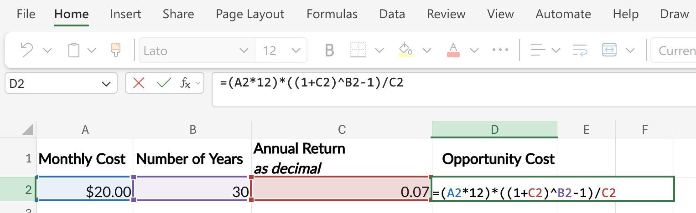

# Tracking Spending

```{r}
#| label: setup-r
#| message: false
#| warning: false
#| include: false
source("_common.R")
```

```{python}
#| label: setup-py
#| include: false
import polars as pl
pl.Config.set_tbl_rows(20)
```

<br>

You only manage what you measure. This chapter covers how to capture every dollar that leaves your accounts and turn that data into insight.

- Capturing every transaction
- Working with digital bank exports
- Categorizing what you've captured
- Reviewing on a monthly cadence
- Spotting "leak" categories (subscriptions, delivery fees, impulse buys)

Tracking is the *recording* side of personal finance. [Budgeting](budgeting.qmd) covers the *allocation* side (where money is supposed to go). Without tracking, a budget is a guess; with tracking, a budget becomes a feedback loop.

```{=html}
<style>

.codeStyle span:not(.nodeLabel) {
  font-family: monospace;
  font-size: 1.5em;
  font-weight: bold;
  color: #9753b8 !important;
  background-color: #f6f6f6;
  padding: 0.2em;
}
</style>
```

```{mermaid}
%%| fig-cap: 'Budget Mindset'
%%| fig-align: center
%%{init: {'theme': 'neutral', 'themeVariables': { 'fontFamily': 'monospace', "fontSize":"16px"}}}%%

flowchart TD
    Budgeting(["<strong>BUDGETING</strong><br/>Where Money<br>Should Go"]) --> Plan("<em>Plan</em>")
    Tracking(["<strong>TRACKING</strong><br/>Where Money<br>Actually Went"]) --> Reality("<em>Reality</em>")

    Plan --> Compare{"<strong>COMPARE</strong>:<br/>Plan vs. Reality"}
    Reality --> Compare

    Compare --> Insights("Insights &<br>Adjustments")
    Insights --> FeedbackLoop(["<em>Feedback</em>"])
    FeedbackLoop --> Budgeting
    style Budgeting fill:#48a56a,color:#F5F2E8,stroke:#1C1C1E,stroke-width:2px
    style Tracking fill:#48a56a,color:#F5F2E8,stroke:#1C1C1E,stroke-width:2px
    style Plan fill:#0e9aa7,color:#F5F2E8,stroke:#1C1C1E,stroke-width:2px
    style Reality fill:#0e9aa7,color:#F5F2E8,stroke:#1C1C1E,stroke-width:2px
    style Compare fill:#f0cfcf,color:#1C1C1E,stroke:#1C1C1E,stroke-width:2px
    style Insights fill:#86ddcd,color:#1C1C1E,stroke:#1C1C1E,stroke-width:2px
    style FeedbackLoop fill:#86ddcd,color:#1C1C1E,stroke:#1C1C1E,stroke-width:2px
```

## Capturing Transactions

Below are a few time-tested ways to capture your spending. If you’re reading this, you’ll also know there’s a sea of apps and digital tools for tracking your spending. It’s important to know people were tracking their spending before the internet, personal computers, and calculators. Regardless of the method you choose, the important thing is to pick one, run it for a full month, then decide whether it works for you.

### A spending journal {.unnumbered}

A small notebook, kept in a pocket or bag. Every time money leaves your hands, you write one line: amount, place, category. At week’s end, you tally. This is the oldest method on the list (Benjamin Franklin [kept one](https://founders.archives.gov/documents/Franklin/01-11-02-0149)). Its strength is the moment of awareness it forces. Writing "\$6 / Starbucks / coffee" by hand is a small pause that an automatically-recorded card swipe will never give you.

### Checkbook registers {.unnumbered}

Every paper checkbook used to come with a register: each transaction logged on its own line, with a running balance. It works for any account where you can list debits and credits. One page per month is plenty. The discipline isn’t the form; it’s that writing each entry keeps you honest about the balance.

### Cash envelope system {.unnumbered}

For variable categories (groceries, dining, gas, fun money), withdraw the monthly amount in cash and split it into physical envelopes labeled by category. When an envelope is empty, that category is done for the month. No swiping, no spreadsheet to update. Depression-era families used envelopes because they had to.[^tracking_spending-1] The system has stuck around because the physical, finite nature of cash slows spending more reliably than any reminder ever will.

[^tracking_spending-1]: Stashing cash around the house was actually quite common for people who lived through the depression. Read more [here](https://www.chicagotribune.com/2005/04/17/inheritance-hide-and-seek/).

### Bank statements {.unnumbered}

Today, we make purchases digitally (via debit and credit cards), so every transaction is already captured for you. The work shifts from capture to review: once a month, pull the bank and card statements, go through them line by line, and assign each transaction to a category. This is the modern equivalent of the ledger, except the bank has done the writing.

## Using Spreadsheets

Digital tracking is the bank-statement method above, but with the math done for you. Most banks allow you to export your monthly statement, which includes three columns: `Date`, `Description`, and `Amount` (negative for money going out, positive for money coming in).

The exported statement almost never includes a category, but you can add it yourself, and we'll do it in [Categorizing Transactions](#categorizing-transactions) below.

::: panel-tabset

## R

Create the `bank_statement` data in R:

```{r}
#| label: bank-statement-r
#| code-fold: show
#| code-summary: 'show/hide R bank_statement'
r_bank_statement <- tibble::tibble(
  Date = as.Date(c(
    "2026-01-02", "2026-01-02", "2026-01-03", "2026-01-03",
    "2026-01-04", "2026-01-04", "2026-01-05", "2026-01-06",
    "2026-01-07", "2026-01-08", "2026-01-09", "2026-01-10",
    "2026-01-11", "2026-01-12", "2026-01-13", "2026-01-14",
    "2026-01-15"
  )),
  Description = c(
    "Employer Payroll",       "Rent",
    "Comcast Internet",       "Trader Joe's",
    "Shell Gas",              "Netflix",
    "Starbucks",              "PG&E Electric",
    "AT&T Wireless",          "Spotify",
    "Whole Foods",            "Chipotle",
    "Geico Auto Insurance",   "NYTimes Digital",
    "Shell Gas",              "Costco",
    "24 Hour Fitness"
  ),
  Amount = c(
     2400.00, -1500.00,
      -75.00,   -82.45,
      -45.20,   -15.99,
       -6.75,  -142.30,
      -85.00,   -10.99,
      -64.12,   -14.50,
     -125.00,   -17.00,
      -42.80,  -156.78,
      -39.99
  )
)
```

We'll use `knitr::kable()` to make the output pretty:

```{r}
#| label: print-bank-statement-r
#| df_print: kable
r_bank_statement |> knitr::kable()
```

## Python

Create the `bank_statement` data in Python (with `polars`):

```{python}
#| label: bank-statement-py
#| code-fold: show
#| code-summary: 'show/hide Python bank_statement'
import polars as pl

py_bank_statement = pl.DataFrame({
    "Date": [
        "2026-01-02", "2026-01-02", "2026-01-03", "2026-01-03",
        "2026-01-04", "2026-01-04", "2026-01-05", "2026-01-06",
        "2026-01-07", "2026-01-08", "2026-01-09", "2026-01-10",
        "2026-01-11", "2026-01-12", "2026-01-13", "2026-01-14",
        "2026-01-15"
    ],
    "Description": [
        "Employer Payroll",     "Rent",
        "Comcast Internet",     "Trader Joe's",
        "Shell Gas",            "Netflix",
        "Starbucks",            "PG&E Electric",
        "AT&T Wireless",        "Spotify",
        "Whole Foods",          "Chipotle",
        "Geico Auto Insurance", "NYTimes Digital",
        "Shell Gas",            "Costco",
        "24 Hour Fitness"
    ],
    "Amount": [
         2400.00, -1500.00,
          -75.00,   -82.45,
          -45.20,   -15.99,
           -6.75,  -142.30,
          -85.00,   -10.99,
          -64.12,   -14.50,
         -125.00,   -17.00,
          -42.80,  -156.78,
          -39.99
    ]
}).with_columns(pl.col("Date").str.to_date())
```

```{python}
#| label: print-bank-statement-py
py_bank_statement
```


## Excel 

The `bank_statement` can also be copied + pasted into Excel: 

{width='75%' fig-align='center'}

Excel also has a handy table format, which give many tools for sorting and analyzing data.[^excel-tables] I'll go into using tables more on the [accompanying website](https://mjfrigaard.github.io/dev-fm-finance/) for the book. 


[^excel-tables]: Read the [Overview of Excel tables](https://support.microsoft.com/en-us/excel/overview-of-excel-tables) on the Microsoft documentation. 

:::


Once your transactions sit in columns and rows, it's much easier to answer tracking questions like:

1.  What is the total spent on subscriptions?\
2.  What percentage of my income is going to fixed costs?\
3.  What was my biggest variable category last month?

[Bogle](https://www.bogleheads.org/) would approve of building a custom spreadsheet because simplicity wins. A well-built spreadsheet beats most apps because it forces you to engage with your numbers.


::::::: {.callout-tip collapse="true"}

## R vs Python: data frames and pipes

Two ideas the categorization code above relies on:

**Data frames**

::: {layout="[50,50]" layout-valign="top"}
R's `data.frame` is built into the base language; the `tibble` is the modern replacement (used throughout this book).

Python has no built-in data frame — you need a library; we use `polars` (`pl.DataFrame`).
:::

::: {layout="[50,50]" layout-valign="top"}

``` r
df <- tibble::tibble(x = 1:5)
```

``` python
import polars as pl
df = pl.DataFrame({"x": [1, 2, 3, 4, 5]})
```
:::

**Pipes / chaining**

::: {layout="[50,50]" layout-valign="top"}

R has a native pipe `|>` (also `%>%` from `magrittr`/`dplyr`) for left-to-right reading: data flows from one function into the next.

Python has no native pipe; the same effect comes from chaining method calls, which `polars` is designed for.

:::

::: {layout="[50,50]" layout-valign="top"}

``` r
df |> dplyr::filter(x > 2)
```

``` python
df.filter(pl.col("x") > 2)
```

:::

:::::::

## Categorizing Transactions {#categorizing-transactions}

Most people overcomplicate categories. Six to ten buckets is plenty, and a small, stable list will outlast any rotating set of "smart" categorizations. A working starter set:

- **Housing** (rent/mortgage, utilities, insurance)
- **Transportation** (car payment, fuel, maintenance, transit)
- **Food — groceries**
- **Food — dining out**
- **Subscriptions** (everything recurring and digital)
- **Personal** (clothes, haircuts, gym)
- **Health & insurance**
- **Gifts & giving**
- **Fun money** (don't break this down further and protect it from over-tracking)
- **Other / one-offs**

Two rules that save hours of bookkeeping:

1.  [When in doubt, "Other".]{style="color:#48a56a; font-weight: bold;"} Don't invent a new category for a single transaction. Review the "Other" bucket at month-end and only promote a new category once you've seen the same kind of transaction three months in a row.
2.  [Keep the categories stable.]{style="color:#48a56a; font-weight: bold;"} Changing categories every month destroys the comparisons that make tracking useful in the first place.

The `bank_statement` dataset above only carries what a real bank export gives you(`Date`, `Description`, and `Amount`). To get to a `Category` column, you have to map descriptions to your buckets yourself. A small lookup of keyword patterns does the job in one pass.

::: panel-tabset
## R

In R, a lookup table can be created using `dplyr`:

```{r}
#| label: categorize-r
#| code-fold: show
#| code-summary: 'show/hide R categorize transactions'
r_bank_statement <- r_bank_statement |>
  dplyr::mutate(
    Category = dplyr::case_when(
      grepl("Payroll",                                   Description) ~ "Income",
      grepl("Rent",                                      Description) ~ "Housing",
      grepl("Comcast|PG&E|AT&T",                         Description) ~ "Utilities",
      grepl("Trader Joe|Whole Foods|Costco",             Description) ~ "Groceries",
      grepl("Shell",                                     Description) ~ "Transportation",
      grepl("Starbucks|Chipotle",                        Description) ~ "Dining",
      grepl("Netflix|Spotify|NYTimes|24 Hour Fitness",   Description) ~ "Subscriptions",
      grepl("Geico",                                     Description) ~ "Insurance",
      TRUE                                                            ~ "Other"
    )
  )

r_bank_statement |> knitr::kable()
```

For use in a Shiny app, the `case_when()` pipeline above can be wrapped into a reusable function that accepts a lookup table, making it easy for users add or edit keyword patterns:

* `df` = `data.frame` with a `Description` column   
* `rules` = `data.frame` with `Pattern` and `Category` columns    

```{r}
#| label: apply-rules-r
#| code-fold: show
#| code-summary: 'show/hide R apply_rules() function'
# Apply keyword rules to categorize transactions
apply_rules <- function(df, rules) {
  df$Category <- "Other"
  for (i in seq_len(nrow(rules))) {
    unmatched <- df$Category == "Other"
    hits <- grepl(rules$Pattern[i], df$Description, ignore.case = TRUE) & unmatched
    df$Category[hits] <- rules$Category[i]
  }
  df
}
```

Create a `data.frame` with `Pattern` and `Category`:

```{r}
#| label: r_rules
#| code-fold: show
#| code-summary: 'show/hide R apply_rules() demo'
r_rules <- data.frame(
  Pattern  = c("Payroll", "Rent", "Comcast|PG&E|AT&T",
               "Trader Joe|Whole Foods|Costco", "Shell",
               "Starbucks|Chipotle",
               "Netflix|Spotify|NYTimes|24 Hour Fitness", "Geico"),
  Category = c("Income", "Housing", "Utilities", "Groceries",
               "Transportation", "Dining", "Subscriptions", "Insurance")
)

r_rules |> 
  knitr::kable()
```

Pass the same keyword lookup as `rules` and the function returns the data frame with a `Category` column appended:

```{r}
#| label: apply-rules-r-demo
#| code-fold: show
#| code-summary: 'show/hide R apply_rules() demo'
apply_rules(r_bank_statement, r_rules) |> 
  knitr::kable()
```

## Python

`polars` closely mirrors the `dplyr` code:

```{python}
#| label: categorize-py
#| code-fold: show
#| code-summary: 'show/hide py categorize transactions'
py_bank_statement = py_bank_statement.with_columns(
    Category = pl.when(pl.col("Description").str.contains("Payroll")).then(pl.lit("Income"))
        .when(pl.col("Description").str.contains("Rent")).then(pl.lit("Housing"))
        .when(pl.col("Description").str.contains("Comcast|PG&E|AT&T")).then(pl.lit("Utilities"))
        .when(pl.col("Description").str.contains("Trader Joe|Whole Foods|Costco")).then(pl.lit("Groceries"))
        .when(pl.col("Description").str.contains("Shell")).then(pl.lit("Transportation"))
        .when(pl.col("Description").str.contains("Starbucks|Chipotle")).then(pl.lit("Dining"))
        .when(pl.col("Description").str.contains("Netflix|Spotify|NYTimes|24 Hour Fitness")).then(pl.lit("Subscriptions"))
        .when(pl.col("Description").str.contains("Geico")).then(pl.lit("Insurance"))
        .otherwise(pl.lit("Other"))
)

py_bank_statement
```

For use in a Shiny app, the `when().then()` chain above can be wrapped into a reusable function that accepts a rules table — making it easy to let users add or edit keyword patterns at runtime:

* `df` = `data.frame` with a `Description` column   
* `rules` = `data.frame` with `Pattern` and `Category` columns   

```{python}
#| label: apply-rules-py
#| code-fold: show
#| code-summary: 'show/hide Python apply_rules() function'
# Apply keyword rules to categorize transactions.

def apply_rules(df, rules):
    df = df.with_columns(pl.lit("Other").alias("Category"))
    for row in rules.iter_rows(named=True):
        df = df.with_columns(
            pl.when(
                pl.col("Description").str.contains(row["Pattern"])
                & (pl.col("Category") == "Other")
            )
            .then(pl.lit(row["Category"]))
            .otherwise(pl.col("Category"))
            .alias("Category")
        )
    return df
```

Pass the same keyword lookup as `rules` and the function returns the data frame with a `Category` column appended:

```{python}
#| label: apply-rules-py-demo
#| code-fold: show
#| code-summary: 'show/hide Python apply_rules() demo'
py_rules = pl.DataFrame({
    "Pattern":  ["Payroll", "Rent", "Comcast|PG&E|AT&T",
                 "Trader Joe|Whole Foods|Costco", "Shell",
                 "Starbucks|Chipotle",
                 "Netflix|Spotify|NYTimes|24 Hour Fitness", "Geico"],
    "Category": ["Income", "Housing", "Utilities", "Groceries",
                 "Transportation", "Dining", "Subscriptions", "Insurance"]
})

apply_rules(py_bank_statement, py_rules)
```

## Excel

In Excel, the [`IFS()` function](https://support.microsoft.com/en-US/Excel/IFS-function) is the direct analog of `case_when()`/`when().then()`. 

*  If the statement is laid out with `Date` in column `A`, `Description` in column `B`, and `Amount` in column `C`. Type `Category` in cell `D1`, then paste the formula below into `D2`:

```swift
=IFS(
  ISNUMBER(SEARCH("Payroll", B2)), "Income",
  ISNUMBER(SEARCH("Rent", B2)), "Housing",
  OR(ISNUMBER(SEARCH("Comcast",B2)), ISNUMBER(SEARCH("PG&E",B2)), ISNUMBER(SEARCH("AT&T",B2))), "Utilities",
  OR(ISNUMBER(SEARCH("Trader Joe",B2)), ISNUMBER(SEARCH("Whole Foods",B2)), ISNUMBER(SEARCH("Costco",B2))), "Groceries",
  ISNUMBER(SEARCH("Shell", B2)), "Transportation",
  OR(ISNUMBER(SEARCH("Starbucks",B2)), ISNUMBER(SEARCH("Chipotle",B2))), "Dining",
  OR(ISNUMBER(SEARCH("Netflix",B2)), ISNUMBER(SEARCH("Spotify",B2)),
     ISNUMBER(SEARCH("NYTimes",B2)), ISNUMBER(SEARCH("24 Hour Fitness",B2))), "Subscriptions",
  ISNUMBER(SEARCH("Geico", B2)), "Insurance",
  TRUE, "Other"
)
```

* Then copy `D2` down through every transaction row (select `D2`, double-click the small square in the bottom-right corner, or use `Ctrl+D` after selecting `D2:D{last_row}`).

{width='100%' fig-align='center'}

To add a new merchant when one shows up: edit the formula in `D2`, then re-fill down. Keep the new merchant near the bottom of its category group so the existing patterns still resolve first.

:::

Each month, add a new pattern when you see a real transaction that didn't match. The goal isn't to classify every edge case up front; the lookup handles 90%+ of your monthly transactions automatically, leaving only the unusual ones to triage by hand.

::::::: {.callout-tip collapse="true"}

## R vs Python: booleans, logicals, and vectorization

The categorization code above uses all three of these ideas at once to create the keyword test:

1.  We use `grepl()` / `str.contains()`) to return a true/false result for every row at once

2.  Then logical-OR alternation chooses between merchants

3.  The final fall-through catches anything that didn't match

Below is a quick summary of these topics in R and Python.

**Boolean values**

::: {layout="[50,50]" layout-valign="top"}
R writes them `TRUE` / `FALSE` (sometimes abbreviated `T`/`F`).

Python writes them `True` / `False`, capitalized, no abbreviation.
:::

::: {layout="[50,50]" layout-valign="top"}
``` r
flag <- TRUE
```

``` python
flag = True
```
:::

**Logical operators**

R uses `&`, `|`, `!` for *vectorized* element-wise logic (and `&&`, `||` for scalar logic).

``` r
c(TRUE, FALSE) & c(TRUE, TRUE) # vectorized
TRUE && FALSE  # scalar
```

Python uses `and`, `or`, `not` for *scalar* logic, and `&`, `|`, `~` for *vectorized* logic in `numpy`/`polars` expressions.

``` python
True and False # scalar

# vectorized:
df.filter((pl.col("a") > 0) & (pl.col("b") < 10))
```

**Vectorization**

::: {layout="[50,50]" layout-valign="top"}
In R, vectors are first-class, so most operations apply element-wise by default.

In Python, native `list` is *not* vectorized; for that you reach for `numpy` arrays or `polars` Series / expressions.
:::

::: {layout="[50,50]" layout-valign="top"}
``` r
c(1, 2, 3) * 2
# returns c(2, 4, 6)
```

``` python
import polars as pl
pl.Series([1, 2, 3]) * 2
# returns Series [2, 4, 6]
```
:::
:::::::

## The Monthly Review

Tracking is only valuable if you actually look at the totals. A monthly review is a thirty-minute habit, scheduled on the same day each month (i.e., the day after your statements close is a natural anchor).

The ritual has four steps:

1.  [Pull]{style="color:#48a56a; font-weight: bold;"} the bank and credit-card statements for the month.
2.  [Categorize]{style="color:#48a56a; font-weight: bold;"} every line into your buckets, using whichever capture method you've chosen.
3.  [Compare]{style="color:#48a56a; font-weight: bold;"} category totals to your budget. Where did you go over? Where did you come in under?
4.  [Pick one change]{style="color:#48a56a; font-weight: bold;"} for next month. *One.* The point is sustainable adjustment, not perfection.

Over a year, twelve small adjustments compound into a budget that actually fits your life. That's the real return on tracking: the calibration loop, not the spreadsheet itself.

## Online Subscriptions

This is the most overlooked category in personal finance. Streaming, apps, software, memberships, deliveries; they're individually small but collectively enormous and can silently drain your accounts.

```{mermaid}
%%| fig-cap: 'Subscription Audit'
%%| fig-align: center
%%{init: {'theme': 'neutral', 'themeVariables': { 'fontFamily': 'monospace', "fontSize":"16px"}}}%%

flowchart TD
    Subscriptions(["Monthly Subscriptions"]) --> Audit("Quarterly Audit")
    Audit --> Use["Used in last 30 days?"]
    Use -->|Yes| Worth["Worth the cost?"]
    Use -->|No| Cancel(["Cancel Today"])
    Worth -->|Yes| Keep("Keep")
    Worth -->|No| Cancel
    Cancel --> Redirect("Redirect to Investments")
    
    style Subscriptions fill:#48a56a,color:#F5F2E8,stroke:#1C1C1E,stroke-width:2px
    style Audit fill:#0e9aa7,color:#F5F2E8,stroke:#1C1C1E,stroke-width:2px
    style Use fill:#f0cfcf,color:#1C1C1E,stroke:#1C1C1E,stroke-width:2px
    style Worth fill:#f0cfcf,color:#1C1C1E,stroke:#1C1C1E,stroke-width:2px
    style Cancel fill:#f44242,color:#F5F2E8,stroke:#1C1C1E,stroke-width:2px
    style Keep fill:#86ddcd,color:#1C1C1E,stroke:#1C1C1E,stroke-width:2px
    style Redirect fill:#86ddcd,color:#1C1C1E,stroke:#1C1C1E,stroke-width:2px
```

### The Subscription Reality Check {.unnumbered}

The average household spends [\$200–\$300/month]{style="color:#f44242; font-weight: bold;"} on subscriptions, often without realizing it.[^online-subs] At \$250/month invested at a 7% real return over 30 years, that's roughly [\$300,000 in lost wealth]{style="color:#f44242; font-weight: bold;"}.

**Action steps:**

1.  Pull your last 3 months of bank/card statements
2.  List every recurring charge
3.  Cancel anything you haven't actively used in 30 days
4.  Set a calendar reminder every 90 days to repeat this
5.  Use one card exclusively for subscriptions to track them easily

[^online-subs]: These numbers are reported on [Next Gen Personal Finance](https://www.ngpf.org/blog/question-of-the-day/question-of-the-day-how-much-does-the-average-consumer-spend-per-month-on-subscription-services/) and [CBS News](https://www.cbsnews.com/newyork/news/experts-suggest-taking-stock-of-how-much-your-monthly-subscriptions-really-cost-before-the-end-of-the-year/)

This isn't deprivation; it's the [Sethi](https://www.iwillteachyoutoberich.com/) principle in action: [cut mercilessly on what you don't love]{style="color:#48a56a;font-weight: bold;font-style: italic;"} so you can spend freely on what you do.

## Math for tracking spending

Below are some tips and tools for tracking spending. Some can be used to easily categorize purchases, others can be used to check the amount you're spending on subscriptions.

### The Subscription Audit Math {.unnumbered}

A \$20/month subscription feels trivial. The chart below shows what that \$240/year could have become if invested instead — each bar is a year when you could have stopped and kept the difference.

```{r}
#| label: subscription-bar-model
#| echo: false
#| fig-cap: "Future value of a $20/month subscription's annual cost if invested at 7%"
#| fig-asp: 0.50
library(ggplot2)
years <- c(0, 5, 10, 20, 30)
values <- c(
  240,
  240 * ((1.07^5  - 1) / 0.07),
  240 * ((1.07^10 - 1) / 0.07),
  240 * ((1.07^20 - 1) / 0.07),
  240 * ((1.07^30 - 1) / 0.07)
)
df_sub <- data.frame(
  year  = factor(paste0("Year ", years), levels = paste0("Year ", years)),
  value = values,
  fill  = c(rep("#0e9aa7", 4), "#f44242")
)
ggplot(df_sub, aes(x = year, y = value, fill = fill)) +
  geom_col(width = 0.6, colour = "#1C1C1E", linewidth = 0.4) +
  geom_text(
    aes(label = paste0("$", formatC(round(value), format = "d", big.mark = ","))),
    vjust = -0.4, fontface = "bold", size = 3.5, colour = "#1C1C1E"
  ) +
  scale_fill_identity() +
  scale_y_continuous(
    labels = function(x) paste0("$", formatC(x, format = "d", big.mark = ",")),
    expand = expansion(mult = c(0, 0.12))
  ) +
  labs(x = "Checkpoint", y = "Accumulated value (7% annual return)") +
  theme_minimal(base_size = 12) +
  theme(
    panel.grid.major.x = element_blank(),
    panel.grid.minor   = element_blank()
  )
```

The formula is just compound growth applied to the annual cost: multiply each year's \$240 by the accumulated growth factor.

**Formula:** Monthly Subscription × 12 × (1.07)\^n = Opportunity cost in *n* years

Example: A \$20/month subscription you don't really use, over 30 years:

- Annual cost: \$240
- Invested at 7% real return for 30 years: [\~\$24,000]{style="color:#f44242; font-weight: bold;"}

That "small" \$20/month is a \$24,000 decision. [Audit accordingly.]{style="color:#48a56a; font-weight: bold;"}

::: panel-tabset

## R

In R, this is a simple function definition with the formula. 

```{r}
#| label: subscription-opp-cost-r
subscription_opportunity_cost <- function(monthly_cost, years, rate = 0.07) {
  annual_cost <- monthly_cost * 12
  annual_cost * ((1 + rate)^years - 1) / rate
}
```

Now lets consider a \$20/month subscription for 30 years at 7%:

```{r}
subscription_opportunity_cost(monthly_cost = 20, years = 30)
```

## Python

Python is similar:

```{python}
#| label: subscription-opp-cost-py
#| eval: true
def subscription_opportunity_cost(monthly_cost, years, rate=0.07):
    annual_cost = monthly_cost * 12
    return annual_cost * ((1 + rate) ** years - 1) / rate
```

The same \$20/month subscription for 30 years at 7%:

```{python}
#| label: subscription-opp-cost-py-use
#| eval: true
subscription_opportunity_cost(monthly_cost=20, years=30)
```

## Excel

In Excel, create a new sheet with the inputs: 

| Monthly cost | Number of Years | Annual Return (as decimal) | Opportunity Cost |
| ------------ | --------------- | -------------------------- | ---------------- |
| $20          | 30              | 0.07                       | *Formula below*  |

The formula (given this setup) is below:

```swift
=(A2*12)*((1+C2)^B2-1)/C2
```

`A2*12` converts the monthly cost to annual; the rest is the future-value-of-an-annuity formula using the rate in `C2` and the time horizon in `B2`. 

{width='100%' fig-align='center'}

:::

## Key takeaways

Tracking is the *recording* side of personal finance; without it, your budget is just a guess. Five rules keep it sustainable:

1.  [Pick one capture method and run it for a month.]{style="color:#48a56a; font-weight: bold;"} Spending journal, checkbook register, cash envelopes, or pulling bank statements — any of them work. Switching every week works for nobody.

2.  [Keep your categories small and stable.]{style="color:#48a56a; font-weight: bold;"} Six to ten buckets is plenty. Stability is what makes month-to-month comparisons meaningful; rotating "smart" categories destroys the very signal you're trying to build.

3.  [Schedule a monthly review and limit yourself to *one* change.]{style="color:#48a56a; font-weight: bold;"} Pull the statements, categorize, compare against your budget, and pick the single biggest leak to plug. Twelve small adjustments per year compound into a budget that actually fits your life.

4.  [Audit subscriptions every quarter.]{style="color:#48a56a; font-weight: bold;"} They're individually small, collectively enormous, and trivially canceled. A \$20/month service you don't really use is roughly a \$24,000 decision over thirty years (see the audit math above), so [Sethi's](https://www.iwillteachyoutoberich.com/) "cut mercilessly on what you don't love" lands hardest here.

5.  [Simplicity wins.]{style="color:#48a56a; font-weight: bold;"} As Bogle would have it for investing, the same applies to tracking: a spreadsheet you'll actually open beats any app you won't.

The point of tracking isn't a perfect ledger; it's the feedback loop. When you can see where your money actually went, next month's allocation in [Budgeting](budgeting.qmd) becomes a decision rather than a guess.
